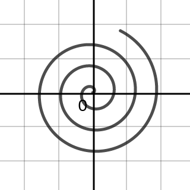
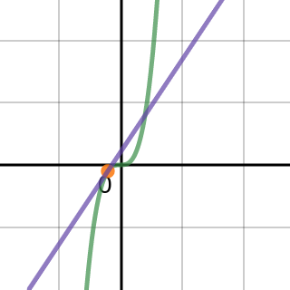
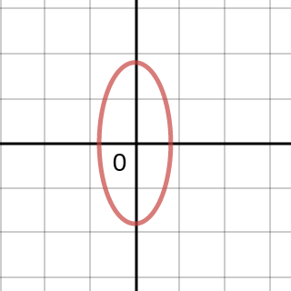

### Section 11.1 Parametric Equations
p735: 1, 2, 7, 8, 11, 13, 15, 17, 18, 19, 23, 29, 31, 33, 35, 45, 48, 51, 55, 57, 58, 60, 63, 64, 69, 71, 79, 81, 89, 91, 99ac, 101

1\. Explain how a set of parametric equations generates a curve in the xy-plane.
>Solution
Given an input value $t$, the point $(x(t), y(t))$ can be plotted in the xy-plane, generating a curve.

2\. Give two sets of parametric equations that generate a circle centered at the origin with radius $6$.
>Solution
$$
\begin{aligned}
x_1 = 6\sin t, y_2 = \cos t\\
x_2 = 6\cos t, y_2 = \sin t\\
\end{aligned}
$$

7-10\. **Working with parametric equations** Consider the following parametric equations.
a. Make a brief table of values of $t, x$, and $y$.
b. Plot the points in the table and the full parametric curve, indicating the positive orientation (the direction of increasing $t$).
c. Eliminate the parameter to obtain an equation in $x$ and $y$.
d. Describe the curve.
7\. $x=2t, y=3t-4; -10 \les t \les 10$
>Solution
t | -10 | 0  | 5  | 10
--|-----|----|----|---
x | -20 | 0  | 10 | 20
y | -30 | -4 | 11 | 26
The curve is the line segment from $(-20, -30)$ to $(20, 26)$.
$$
\begin{aligned}
x &= 2t \To t = \frac{x}{2}\\
y &= 3t-4 = \frac{3x}{2} -4
\end{aligned}
$$

8\. $x=t^2 + 2, y=4t; -4 \les t \les 4$
>Solution
t | -4  | -2 | 0 | 2 | 4
--|-----|----|---|---|---
x | 18  | 6  | 2 | 6 | 18
y | -16 | -8 | 0 | 8 | 16
The curve is the segment of parabolic curve opening towars right.
$$
\begin{aligned}
y &= 4t \To t = \frac{y}{4}\\
x &= t^2 + 2 = \frac{y^2}{16} + 2
\end{aligned}
$$

11-16\. **Working with parametric equations** Consider the following parametric equations.
a. Eliminate the parameter to obtain an equation in $x$ and $y$.
b. Describe the curve and indicate the positive orientation.
11\. $x=\sqrt t + 4, y=3\sqrt t; 0 \les t \les 14$
>Solution
$$
\begin{aligned}
x &= \sqrt t + 4 \To \sqrt t = x-4\\
y &= 3\sqrt t = 3(x-4) \quad \{4 \les x \les 8\}
\end{aligned}
$$
The curve is the line segment from $(4, 0)$ to $(8, 12)$.

13\. $x=\cos t, y=\sin^2 t; 0 \les t \les \pi$
>Solution
$$
\begin{aligned}
x^2 &= \cos^2 t\\
y &= \sin^2 t = 1-\cos^2 t = 1-x^2 \quad\{-1 \les x \les 1\}
\end{aligned}
$$
The curve is a parabola opening downward, from $(1, 0)$ to $(-1, 0)$.

15\. $x=t-1, y=t^3; -4 \les t \les 4$
>Solution
$$
\begin{aligned}
x &=t-1 \To t = x+1\\
y &= t^3 = (x+1)^3 \quad\{-5 \les x \les 3\}
\end{aligned}
$$
The curve is a cubic curve from $(-5, -64)$ to $(3, 64)$.

17-22\. **Circles and arcs** Eliminate the parameter to find a description of the following circles or circular arcs in terms of x and y. Give the center and radius, and indicate the positive orientation.
17\. $x=3\cos t, y=3\sin t; \pi \les t \les 2\pi$
>Solution
$$
\begin{aligned}
x^2 + y^2 = 9\cos^2 t + 9\sin^2 t = 9
\end{aligned}
$$
This represent a circular arc of radius 3 centered at the origin, and the direction is counterclockwise.

18\. $x=3\cos t, y=3\sin t; 0 \les t \les \frac{\pi}{2}$
>Solution
$$
\begin{aligned}
x^2 + y^2 = 9\cos^2 t + 9\sin^2 t = 9
\end{aligned}
$$
This represent a circular arc of radius 3 centered at the origin, and the direction is counterclockwise.

19\. $x=\cos t, y= 1 + \sin t; 0 \les t \les 2\pi$
>Solution
$$
\begin{aligned}
x^2 + (y-1)^2 = \cos^2 t + \sin^2 t =1
\end{aligned}
$$
This represent a circle of radius 1 centered at the $(0, 1)$, and the direction is counterclockwise.

23-28\. **Parametric equations of circles** Find parametric equations (not unique) for the following circles and give an interval for the parameter values. Graph the circle and find a description in terms of $x$ and $y$.
23\. A circle centered at the origin with radius $4$, generated counterclockwise.
>Solution
Let $x=4\cos t, y=4\sin t$, for $0 \les t \les 2\pi$. Then $x^2+y^2 = 16$.

29–32\. **Circular motion** Find parametric equations that describe the circular path of the following objects. Assume $(x, y)$ denotes the position of the object relative to the origin at the center of the circle. Use the units of time specified in the problem. There is more than one way to describe any circle.
29\. A go-cart moves counterclockwise with constant speed around a circular track of radius $400$ m, completing a lap in $1.5$ min.
>Solution
Let $t$ be the time, $0 \les t \les 1.5, x = 400 \cos (\frac{4\pi}{3}t), y = 400 \sin (\frac{4\pi}{3}t)$

31\. A bicyclist rides counterclockwise with constant speed around a circular velodrome track with a radius of $50$ m, completing one lap in $24$ s.
>Solution
Let $t$ be the time, $0 \les t \les 24, x = 50 \cos (\frac{\pi}{12}t), y = 50 \sin (\frac{\pi}{12}t)$

33–36\. **Parametric lines** Find the slope of each line and a point on the line. Then graph the line.
33\. $x = 3 + t, y = 1 - t$
>Solution
Graph (33).
$$
\begin{aligned}
x &= 3 + t \To t = x-3\\
y &= 1 - t = 4-x\\
y' &= -1 &\text{slope of the line}
\end{aligned}
$$

35\. $x = 8 + 2t, y = 1$
>Solution
Graph (35).
$$
\begin{aligned}
y &= 1\\
y' &= 0 &\text{slope of the line}
\end{aligned}
$$

45–50\. **More parametric curves** Use a graphing utility to graph the following curves. Be sure to choose an interval for the parameter that generates all features of interest.
45\. **Spiral** $x = t \cos t, y = t \sin t; t \ges 0$
>Solution
.

48\. **Involute of a circle** $x = \cos t + t \sin t, y = \sin t - t \cos t$.
>Solution
.

51–54\. **Beautiful curves** Consider the family of curves
$x=(2+\dfrac{1}{2}\sin at)\cos(t+\dfrac{\sin bt}{c}), y=(2+\dfrac{1}{2}\sin at)\sin(t+\dfrac{\sin bt}{c})$
Plot the curve for the given values of $a$, $b$, and $c$ with  $0 \les t \les 2\pi$ (Source: Stan Wagon, Mathematica in Action, 3rd Ed., Springer; created by Norton Starr, Amherst College.)
51\. $a=b=5, c=2$
>Solution
.

55–60\. Derivatives Consider the following parametric curves.
a. Determine $\dfrac{dy}{dx}$ in terms of $t$ and evaluate it at the given value of $t$.
b. Make a sketch of the curve showing the tangent line at the point corresponding to the given value of $t$.
55\. $x = 2 + 4t, y = 4 - 8t; t = 2$
>Solution
$$
\begin{aligned}
\frac{dy}{dx} &= \frac{y'(t)}{x'(t)} = \frac{-8}{4} =-2\\
\frac{dy}{dx} \mid_{t=2} &= -2
\end{aligned}
$$
Graph (55).

57\. $x=\cos t, y= 8\sin t; t=\frac{\pi}{2}$
>Solution
$$
\begin{aligned}
\frac{dy}{dx} &= \frac{y'(t)}{x'(t)} = \frac{8\cos t}{-\sin t} =-8\cot t\\
\frac{dy}{dx} \mid_{t=\frac{\pi}{2}} &= 0
\end{aligned}
$$
.

58\. $x = 2t, y = t^3; t = - 1$
>Solution
$$
\begin{aligned}
\frac{dy}{dx} &= \frac{y'(t)}{x'(t)} = \frac{3t^2}{2}\\
\frac{dy}{dx} \mid_{t=-1} &= \frac{3}{2}
\end{aligned}
$$
.

60\. $x = \sqrt t, y = 2t; t = 4$
>Solution
$$
\begin{aligned}
\frac{dy}{dx} &= \frac{y'(t)}{x'(t)} = \frac{2}{\frac{1}{2\sqrt t}} = 4\sqrt t\\
\frac{dy}{dx} \mid_{t=4} &= 8
\end{aligned}
$$
.

62–65\. **Tangent lines** Find an equation of the line tangent to the curve at the point corresponding to the given value of $t$.
62\. $x=\sin t, y=\cos t; t=\frac{\pi}{4}$
>Solution
$$
\begin{aligned}
\frac{dy}{dx} &= \frac{y'(t)}{x'(t)} = \frac{-\sin t}{\cos t} = -\tan t\\
\frac{dy}{dx} \mid_{t=\frac{\pi}{4}} &= -1\\
y - \cos (\frac{\pi}{4}) &= -1(x-\sin \frac{\pi}{4})\\
y &= -x + \sqrt 2 &\text{the tangent line when }t=\frac{\pi}{4}
\end{aligned}
$$

63\. $x=t^2-1, y = t^3 + t; t=2$
>Solution
$$
\begin{aligned}
\frac{dy}{dx} &= \frac{y'(t)}{x'(t)} = \frac{3t^2 + 1}{2t}\\
\frac{dy}{dx} \mid_{t=2} &= \frac{13}{4}\\
y - 10 &= \frac{13}{4}(x-3)\\
y &= \frac{13}{4}x + \frac{1}{4} &\text{the tangent line when }t=2
\end{aligned}
$$

64\. $x=e^t, y = \ln (t+1); t=0$
>Solution
$$
\begin{aligned}
\frac{dy}{dx} &= \frac{y'(t)}{x'(t)} = \frac{1}{e^t(t+1)}\\
\frac{dy}{dx} \mid_{t=0} &= \frac{1}{e}\\
y - 0 &= \frac{1}{e}(x-1)\\
y &= \frac{1}{e}x - \frac{1}{e} &\text{the tangent line when }t=0
\end{aligned}
$$

66-69\. **Words to curves** Find parametric equations for the following curves. Include an interval for the parameter values.
69\. The upper half of the parabola $x = y^2$, originating at $(0, 0)$
>Solution
$x=t^2, y=t, t\in [0, \infty)$

71–72\. **Ellipses** An ellipse (discussed in detail in Section 11.4) is generated by the parametric equations $x = a\cos t, y = b \sin t$. If $0 < a < b$, then the long axis (or major axis) lies on the y-axis and the short axis (or minor axis) lies on the x-axis. If $0< b< a$, the axes are reversed. The lengths of the axes in the x- and y-directions are 2a and 2b, respectively. Sketch the graph of the following ellipses. Specify an interval in $t$ over which the entire curve is generated.
71\. $x = 4\cos t, y = 9 \sin t$
>Solution
$t\in [0, 2\pi]$.
.

79–84\. **Eliminating the parameter** Eliminate the parameter to express the following parametric equations as a single equation in $x$ and $y$.
79\. $x = 2\sin 8t, y = 2 \cos 8t$
>Solution
$$
\begin{aligned}
x^2 + y^2 = 4\sin^2 8t + 4\cos^2 8t = 4
\end{aligned}
$$

81\. $x=t, y=\sqrt {4-t^2}$
>Solution
$$
\begin{aligned}
y=\sqrt {4-x^2}
\end{aligned}
$$

89–90\. **Equivalent descriptions** Find real numbers $a$ and $b$ such that equations A and B describe the same curve.
89\. $A: x=10\sin t, y=10\cos t; 0\les t \les 2\pi$ and $A: x=10\sin 3t, y=10\cos 3t; a\les t \les b$
>Solution
$a=0, b=\frac{2\pi}{3}$

91–92\. **Lissajous curves** Consider the following Lissajous curves. Find all points on the curve at which there is (a) a horizontal tangent line and (b) a vertical tangent line. (See the Guided Project Parametric Art for more on Lissajous curves.)
91\. $x = \sin 2t, y = 2 \sin t; 0 \les t \les 2\pi$
>Solution
$$
\begin{aligned}
\frac{dy}{dx} &= \frac{y'(t)}{x'(t)} = \frac{\cos t}{\cos 2t}\\
\end{aligned}
$$
a. Horizontal tangent lines occur when $\cos t = 0$ and $\cos 2t \ne 0$. Thus $t=\frac{\pi}{2}, \frac{3\pi}{2}$. The points are $(0, 2), (0, -2)$.
b. Vertical tangent line occur when $\cos 2t = 0$ and $\cos t \ne 0$. Thus $t=\frac{\pi}{4}, \frac{3\pi}{4}, \frac{5\pi}{4}, \frac{7\pi}{4}$. The points are $(1, \sqrt 2), (-1, \sqrt 2), (-1, -\sqrt 2), (1,-\sqrt 2)$.

99\. **Paths of the moons of Earth and Jupiter** Use the equations in Exercise 98 to plot the paths of the following moons in our solar system.
a. Each year our moon revolves around Earth about $n = 13.4$ times and the distance from the Sun to Earth is approximately $a = 389.2$ times the distance from Earth to our moon.
>Solution
.

c. Plot a graph of the path of Io (another of Jupiter's moons) that corresponds to values of $a = 1846.2$ and $n = 2448.8$. Plot a small portion of the path of Io to see the loops in the orbits.
>Solution
.

101\. **Air drop—inverse problem** A plane traveling horizontally at $100 m/s$ over flat ground at an elevation of $4000$ m must drop an emergency packet on a target on the ground. The trajectory of the packet is given by $x=100t, y=-4.9t^2+4000$, for $t \ges 0$, where the origin is the point on the ground directly beneath the plane at the moment of the release. How many horizontal meters before the target should the packet be released in order to hit the target?
>Solution
$$
\begin{aligned}
y = -4.9t^2+4000 = 0 \To t = \sqrt {\frac{4000}{4.9}}\\
x = 100t = 100\cdot \sqrt {\frac{4000}{4.9}} \approx 2857m
\end{aligned}
$$
