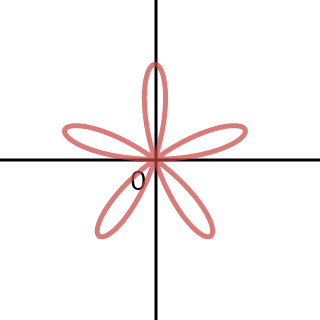
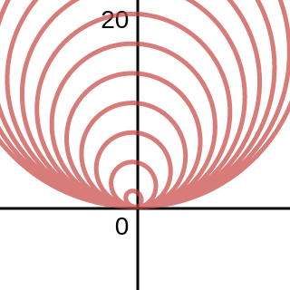
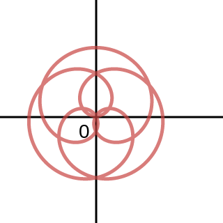
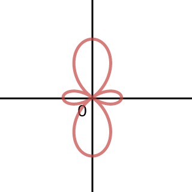
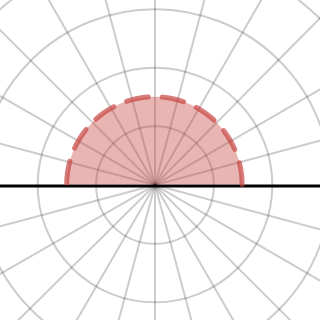
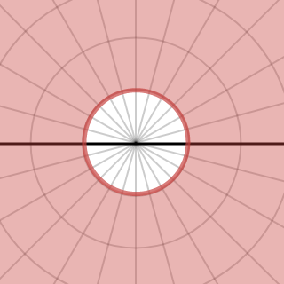
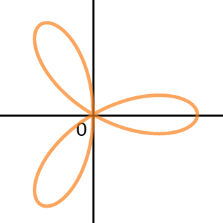
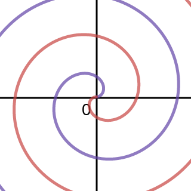

### Section 11.2 Polar Coordinates
p748: 4, 11, 13, 14, 15, 17, 19, 21, 24, 25, 27, 29, 30, 35, 36, Graph by hand: *37, 38, 41, 47*, 48, 49, 51, **53**, 58, **59**, 61ac, 62, 65, 68, 72, 73, 89, by hand 96, 100, 110de

4\. What is the polar equation of a circle of radius $|a|$ centered at the origin?
>Solution
$r=|a|$

9–13\. Graph the points with the following polar coordinates. Give two alternative representations of the points in polar coordinates.
11\. $(-1, -\frac{\pi}{3})$
>Solution
Graph (11).
$(1, \frac{2\pi}{4}), (-1, \frac{5\pi}{3})$

13\. $(-4, \frac{3\pi}{2})$
>Solution
Graph (13).
$(4, \frac{\pi}{2}), (-4, -\frac{\pi}{2})$

14\. **Points in polar coordinates** Give two sets of polar coordinates for each of the points A–F in the figure. Graph (14).
>Solution
$$
\begin{aligned}
A: (4, \frac{\pi}{6}), (4, -\frac{11\pi}{6}) \qquad B: (3, \frac{\pi}{4}), (3, -\frac{7\pi}{4})\\
C: (2, \frac{\pi}{3}), (2, -\frac{5\pi}{3}) \qquad D: (4, \frac{\pi}{2}), (4, -\frac{3\pi}{2})\\
E: (2, \frac{4\pi}{3}), (2, -\frac{2\pi}{3}) \qquad F: (4, \frac{5\pi}{3}), (4, -\frac{\pi}{3})\\
\end{aligned}
$$

15–20\. **Converting coordinates** Express the following polar coordinates in Cartesian coordinates.
15\. $(3, \frac{\pi}{4})$
>Solution
$(\frac{3\sqrt 2}{2}, \frac{3\sqrt 2}{2})$

17\. $(1, -\frac{\pi}{3})$
>Solution
$(\frac{1}{2}, -\frac{\sqrt 3}{2})$

19\. $(-4, \frac{3\pi}{4})$
>Solution
$(2\sqrt 2, -2\sqrt 2)$

21–26\. **Converting coordinates** Express the following Cartesian coordinates in polar coordinates in at least two different ways.
21\. $(2, 2)$
>Solution
$(2\sqrt 2, \frac{\pi}{4}), (2\sqrt 2, -\frac{7\pi}{4})$

24\. $(-9, 0)$
>Solution
$(9, \pi), (9, -\pi)$

25\. $(-4, 4\sqrt 3)$
>Solution
$(8, \frac{2\pi}{3}), (8, -\frac{4\pi}{3})$

27–36\. **Polar-to-Cartesian coordinates** Convert the following equations to Cartesian coordinates. Describe the resulting curve.
27\. $r\cos \th = -4$
>Solution
$x=-4$. This is a vertical line through $(-4, 0)$.

29\. $r=2$
>Solution
$x^2 + y^2 = 4$. This is a circle centered at the origin with radius of $2$.

30\. $r=3\csc \th$
>Solution
$y=3$. This is a horizontal line through $(0, 3)$

35\. $r=8\sin \th$
>Solution
$$
\begin{aligned}
r^2 = 8r\sin \th\\
x^2 + y^2 - 8y =0\\
x^2 +(y-4)^2 = 16
\end{aligned}
$$
This is a circle centered at $(0, 4)$ with radius of $4$.

36\. $r=\dfrac{1}{2\cos\th + 3\sin \th}$
>Solution
$$
\begin{aligned}
r(2\cos\th + 3\sin \th) =1\\
2x+3y=1\\
y= \frac{1}{3} - \frac{2x}{3}
\end{aligned}
$$
This is a line through $(0, \frac{1}{3}), (\frac{1}{2}, 0)$

37–40\. **Simple curves** Tabulate and plot enough points to sketch a graph of the following equations.
37\. $r=8\cos \th$
>Solution
Todo

38\. $r=4+4\cos \th$
>Solution
Todo

41–48\. **Graphing polar curves** Graph the following equations. Use a graphing utility to check your work and produce a final graph.
41\. $r=1-\sin \th$
>Solution
Todo

47\. $r=\sin 3\th$
>Solution
Todo

48\. $r=2\sin 5\th$
>Solution

49–52\. **Matching polar and Cartesian curves** A Cartesian and a polar graph of $r=f(\th)$ are given in the figures. Mark the points on the polar graph that correspond to the points shown on the Cartesian graph.
49\. $r=1-2\sin 3\th$
>Solution
Todo

51\. $r=\frac{1}{4}-\cos 4\th$
>Solution
Todo

53–60\. **Using a graphing utility** Use a graphing utility to graph the following equations. In each case, give the smallest interval $[0, P]$ that generates the entire curve (if possible).
53\. $r=\th \sin \th$
>Solution
No finite interval can generate the entire graph.

58\. $r=\sin(\frac{3\theta}{7})$
>Solution
The interval $[0, \frac{14\pi}{3}]$

59\. $r=1-3\cos 2\theta$
>Solution
The interval $[0, \pi]$

61\. **Explain why or why not** Determine whether the following statments are true and give an explanation or counterexample.
a. The point with Cartesian coordinates $(-2, 2)$ has polar coordinates $(2\sqrt 2, \frac{3\pi}{4}), (2\sqrt 2, \frac{11\pi}{4}), (2\sqrt 2, -\frac{5\pi}{4})$ and $(-2\sqrt 2, -\frac{\pi}{4})$
>Solution
True.

c. The graph of $r=2$ and $\th = \frac{\pi}{4}$ intersect exactly once.
>Solution
False. They intersect twice, one at $(2, \frac{\pi}{4})$, and the other one at $(-2, \frac{\pi}{4})$

62–65\. **Cartesian-to-polar coordinates** Convert the following equations to polar coordinates.
62\. $y=3$
>Solution
$r\sin \th = 3$

65\. $y=\frac{1}{x}$
>Solution
$r^2\sin \th \cos \th = 1$

66–73\. **Sets in polar coordinates** Sketch the following sets of points.
68\. $\{(r, \th); 2\les r\les 8\}$
>Solution

72\. $\{(r, \th); |r|<3 \text{ and } 0\les \th \les \pi\}$
>Solution

73\. $\{(r, \th); r\ges 2\}$
>Solution

89\. **The limacon family** The equations $r = a + b \cos u$ and $r = a + b \sin u$ describe curves known as limaçons (from Latin for snail). We have already encountered cardioids, which occur when $|a| = |b|$. The limaçon has an inner loop if $|a| < |b|$. The limaçon has a dent or dimple if $|b| < |a| < 2|b|$. And, the limaçon is oval-shaped if $|a| > 2|b|$. Match the limaçons in the figures A–F with equations a–f.
a. $r=-1+\sin \th$ &emsp; b. $r=-1+2\cos \th$
c. $r=2+\sin \th$ &emsp; d. $r=1-2\cos \th$
e. $r=1+2\sin \th$ &emsp; f. $r=1+\frac{2}{3}\sin \th$
>Solution
a $\to$ A &emsp; b $\to$ C &emsp; c $\to$ B
d $\to$ D &emsp; e $\to$ E &emsp; f $\to$ F

95–98\. **The rose family** Equations of the form $r = a \sin m\th$ or $r = a \cos m\th$, where $a$ and $b$ are real numbers and $m$ is a positive integer, have graphs known as roses (see Example 6). Graph the following roses.
96\. $r=4\cos 3\th$
>Solution

100–102\. **Spirals** Graph the following spirals. Indicate the direction in which the spiral winds outward as $\th$ increases, where $\th >0$. Let $a = 1$ and $a = -1$.
100\. Spiral of Archimedes: $r = a\th$
>Solution

110\. **Channel flow** Water flows in a shallow semicircular channel with inner and outer radii of $1 m$ and $2 m$ (see figure). At a point $P(r, \th)$ in the channel, the flow is in the tangential direction (counterclockwise along circles), and it depends only on $r$, the distance from the center of the semicircles.
d. Suppose the tangential velocity of the water is given by $v(r) = \frac{20}{r}, 1 \les r\les 2$. Is the velocity greater at $(1.8, \frac{\pi}{6})$ or $(1.3, \frac{2\pi}{3})$? Explain.
>Solution
The velocity would be greater at $(1.3, \frac{2\pi}{3})$, because $\frac{20}{1.3} > \frac{20}{1.8}$.

e. The total amount of water that flows through the channel
(across a cross section of the channel $\th = \th_0$) is proportional to $\dint_1^2 v(r)dr$. Is the total flow through the channel greater for the flow in part (c) or (d)?
>Solution
$v(r) = 10r \To \dint_1^2 v(r)dr = 5r^2 \mid_1^2 = 120$
$v(r) = \dfrac{20}{r} \To \dint_1^2 v(r)dr = 20(\ln r) \mid_1^2 = 13.86$
Thus, the flow in part (c) would be greater then that in part (d).
