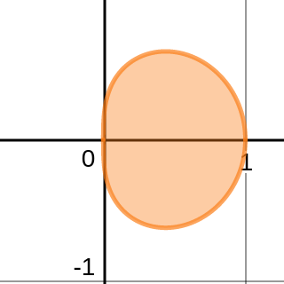
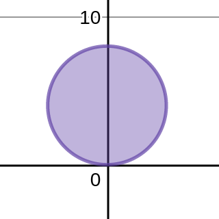
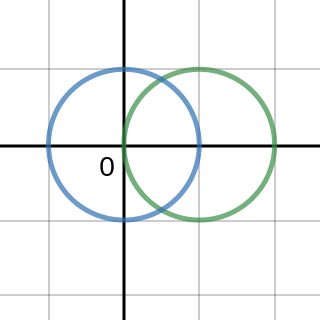
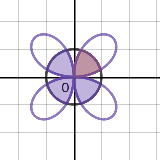
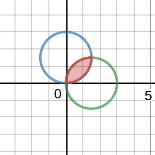
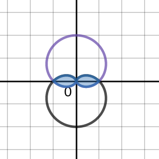
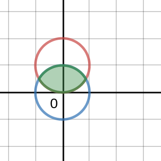
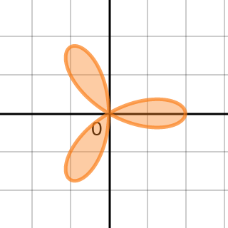

### Section 11.3 Calculus In Polar Coordinates
p758: 2, 3, 4, 5, 7, **9**, 11, 15, **19**, 21, 23, 24, 27, 29, 31, 35, 37, 38, 41, 42, 47, 54?. Plan to do this assignment in more than one sitting as the problems are very long. Make each problem from #5 on worth double value since they are more involved.

2\. How do you find the slope of the line tangent to the polar graph of $r = f(\th)$ at a point?
>Solution
$\dfrac{dy}{dx} = \dfrac{f'(\th)\sin \th + f(\th)\cos \th}{f'(\th)\cos \th - f(\th)\sin \th}$

3\. Explain why the slope of the line tangent to the polar graph of
$r = f(\th)$ is not $dr/d\th$.
>Solution
Because the slope is defined as the rate of change of vertical coordinate $y$ with respect to horizontal coordinate $x$, which is $dy/dx$, not $dr/d\th$.

4\. What integral must be evaluated to find the area of the region bounded by the polar graphs of $r = f (\th)$ and $r = g(\th)$ on the interval $a \les \th \les b$, where $f (\th) \ges g(\th) \ges 0$?
>Solution
$\dint_a^b \frac{1}{2}(f(\th)^2 - g(\th)^2) d\th$

5–14\. **Slopes of tangent lines** Find the slope of the line tangent to the following polar curves at the given points. At the points where the curve intersects the origin (when this occurs), find the equation of the tangent line in polar coordinates.
5\. $r=1-\sin \th; (\frac{1}{2}, \frac{\pi}{6})$
>Solution
$$
\begin{aligned}
\frac{dy}{dx} &= \frac{f'(\th)\sin \th + f(\th)\cos \th}{f'(\th)\cos \th - f(\th)\sin \th}\\
&= \frac{-\cos \th \sin \th + (1-\sin \th)\cos \th}{-\cos^2 \th -(1-\sin \th)\sin \th}\\
\frac{dy}{dx} \mid_{\th=\frac{\pi}{6}} &= \frac{0}{-1} = 0 &\text{(1)}\\
r&=1-\sin \th = 0\\
\To \th &= \frac{\pi}{2} &\text{(2)}
\end{aligned}
$$
The given curve intersects the origin when $\th =\frac{\pi}{2}$. At this point $\frac{dy}{dx}$ does not exist, as the tangent line is vertical.

7\. $r= 8\sin \th; (4, \frac{5\pi}{6})$
>Solution
$$
\begin{aligned}
\frac{dy}{dx} &= \frac{f'(\th)\sin \th + f(\th)\cos \th}{f'(\th)\cos \th - f(\th)\sin \th}\\
&= \frac{8\cos \th \sin \th + 8\sin \th \cos \th}{8\cos^2 \th - 8\sin \th \sin \th}\\
\frac{dy}{dx} \mid_{\th=\frac{5\pi}{6}} &= \frac{8 \cdot (-\frac{\sqrt 3}{2})}{8 \cdot (\frac{3}{4} - \frac{1}{4})} = -\sqrt 3 &\text{(1)}\\
r&=8\sin \th = 0\\
\To \th &= 0, \pi &\text{(2)}
\end{aligned}
$$
The given curve intersects the origin when $\th =0, \pi$. At these points $\frac{dy}{dx} = 0$, the tangent line is horizontal, namely $\th = 0$.

9\.$r=6+3\cos \th; (3,\pi), (9, 0)$
>Solution
$$
\begin{aligned}
\frac{dy}{dx} &= \frac{f'(\th)\sin \th + f(\th)\cos \th}{f'(\th)\cos \th - f(\th)\sin \th}\\
&= \frac{-3\sin^2 \th + (6+3\cos \th)\cos \th}{-3\sin \th\cos \th - (6+3\cos \th)\sin \th}\\
\frac{dy}{dx} \mid_{\th=0, \pi} & \text{ does not exist.}
\end{aligned}
$$
The curve does not intersects with the origin, because $r\ges 3$ for all $\th$.

11\. $r=4\cos 2\th$; at the tips of the leaves.
>Solution
The tips of the leaves occur at $\th = 0, \frac{\pi}{2}, \pi$ and $\frac{3\pi}{2}$.
$$
\begin{aligned}
\frac{dy}{dx} &= \frac{f'(\th)\sin \th + f(\th)\cos \th}{f'(\th)\cos \th - f(\th)\sin \th}\\
&= \frac{-8\sin 2\th \sin \th + 4\cos 2\th \cos \th}{-8\sin 2\th \cos \th - 4\cos 2\th \sin \th}\\
\frac{dy}{dx} \mid_{\th=0, \pi} & \text{ does not exist.}\\
\frac{dy}{dx} \mid_{\th=\frac{\pi}{2}, \frac{3\pi}{2}} &= 0
\end{aligned}
$$
The curve intersects the origin when $\th= \frac{\pi}{4}, \frac{3\pi}{4}, \frac{5\pi}{4}$ and $\frac{7\pi}{4}$. The tangent line are $\th = \frac{\pi}{4}, \frac{3\pi}{4}$.

15–20\. **Horizontal and vertical tangents** Find the points at which the following polar curves have a horizontal or a vertical tangent line.
15\. $r=4\cos \th$
>Solution
$$
\begin{aligned}
\frac{dy}{dx} &= \frac{f'(\th)\sin \th + f(\th)\cos \th}{f'(\th)\cos \th - f(\th)\sin \th}\\
&=\frac{-4\sin^2 \th + 4\cos^2 \th}{-4\sin \th \cos \th - 4\cos \th\sin \th}\\
&= -\frac{\cos 2\th}{\sin 2\th}
\end{aligned}
$$
1\. Horizontal tangent line: $\cos 2\th = 0$ and $\sin 2\th \ne 0$. Thus $\th = \frac{\pi}{4}, \frac{3\pi}{4}$, and the points are $(2\sqrt 2, \frac{\pi}{4}), (-2\sqrt 2, \frac{3\pi}{4})$.
2\. Vertical tangent line: $\cos 2\th \ne 0$ and $\sin 2\th = 0$. Thus $\th = 0, \frac{\pi}{2}$, and the points are $(4, 0), (0, \frac{\pi}{2})$.

19\. $r=1- \sin \th$
>Solution
$$
\begin{aligned}
\frac{dy}{dx} &= \frac{f'(\th)\sin \th + f(\th)\cos \th}{f'(\th)\cos \th - f(\th)\sin \th}\\
&= \frac{-\cos \th \sin \th + (1-\sin \th)\cos \th}{-\cos^2 \th - (1-\sin \th)\sin \th}\\
&= \frac{\cos \th (1-2\sin \th)}{(\sin \th-1)(2\sin \th + 1)}
\end{aligned}
$$
$$
\begin{aligned}
\text{Horizontal tangent line}\\
&\begin{gathered}
\cos \th (1-2\sin \th) = 0 \\
(\sin \th-1)(2\sin \th + 1) \ne 0
\end{gathered} \To \th = \frac{\pi}{6}, \frac{5\pi}{6}, \frac{3\pi}{2}\\
\text{Vertical tangent line}\\
&\begin{gathered}
\cos \th (1-2\sin \th) \ne 0 \\
(\sin \th-1)(2\sin \th + 1) = 0
\end{gathered} \To \th = \frac{7\pi}{6}, \frac{11\pi}{6}
\end{aligned}
$$
1\. The horizontal tangent lines occur at points $(\frac{1}{2}, \frac{\pi}{6}), (\frac{1}{2}, \frac{5\pi}{6})$ and $(3, \frac{3\pi}{2})$.
2\. The vertical tangent lines occur at points $(\frac{3}{2}, \frac{7\pi}{6}), (\frac{3}{2}, \frac{11\pi}{6})$.
3\. When $\th = \frac{\pi}{2}$, both the numerator and the denominator of the derivative are zero. Therefore, $dy/dx$ may be computed as a limit using l'Hopital's Rule. As $\th \to \frac{\pi}{2}$, we find that
$$
\begin{aligned}
\frac{dy}{dx} &= \lim_{\th \to \frac{\pi}{2}} \frac{\cos \th (1-2\sin \th)}{(\sin \th-1)(2\sin \th + 1)}\\
&= \lim_{\th \to \frac{\pi}{2}} \frac{\cos \th -\sin 2\th}{2\sin^2 \th - \sin \th -1}\\
&= \lim_{\th \to \frac{\pi}{2}} \frac{-\sin \th - 2\cos 2\th}{4\sin \th \cos \th - \cos \th}\\
&= \frac{-1 + 2}{0} = \infty
\end{aligned}
$$
Thus, there is a vertical tangent line at point $(0, \frac{\pi}{2})$ as well.

21–36\. **Areas of regions** Make a sketch of the region and its bounding curves. Find the area of the region.
21\. The region inside the curve $r=\sqrt{\cos \th}$.

>Solution
$$
\begin{aligned}
A &= 2\int_0^{\pi/2} \frac{1}{2} (\sqrt{\cos \th})^2 d\th\\
&=\int_0^{\pi/2} \cos \th d\th\\
&=(\sin \th)\mid_0^{\pi/2}\\
&=1-0=1
\end{aligned}
$$

### sdadf
23\. The region inside the circle $r = 8 \sin \th$.

>Solution
$$
\begin{aligned}
A &= \int_0^{\pi} \frac{1}{2} (8\sin \th)^2 d\th\\
&=\int_0^{\pi} (16-16\cos 2\th)d\th\\
&=(16\th - 8\sin 2\th)\mid_0^{\pi}\\
&=(16 \cdot \pi - 0 - 0 -0) = 16\pi
\end{aligned}
$$

24\. The region inside the cardioid $r=4+4\sin \th$.

>Solution
$$
\begin{aligned}
A &= \int_0^{2\pi} \frac{1}{2} (4+4\sin \th)^2 d\th\\
&= 4\int_0^{2\pi}(3+4\sin \th - \cos 2\th)d\th\\
&= 4(3\th - 4\cos\th - \frac{1}{2}\sin 2\th)\mid_0^{2\pi}\\
&= 4(3\cdot 2\pi - 4 - 0 -0 + 4 -0) = 24\pi
\end{aligned}
$$

27\. The region inside one leaf of $r=\cos 3\th$.

>Solution
$$
\begin{aligned}
A &= 2\int_0^{\frac{\pi}{6}} \frac{1}{2} \cos^2 3\th d\th\\
&=\frac{1}{2}\int_0^{\frac{\pi}{6}} (\cos 6\th+1) d\th\\
&=\frac{1}{2}(\frac{1}{6}\sin 6\th + \th)\mid_0^{\frac{\pi}{6}} = \frac{\pi}{12}
\end{aligned}
$$

29\. The region outside the circle $r =\frac{1}{2}$ and inside the circle $r = \cos \th$

>Solution
1\. Intersection: $\cos \th = \frac{1}{2} \To \th = \frac{\pi}{3},-\frac{\pi}{3}$
2\. Integration
$$
\begin{aligned}
A &= \frac{1}{2}\int_{-\frac{\pi}{3}}^{\frac{\pi}{3}} (\cos^2 \th - \frac{1}{4}) d\th\\
&= \frac{1}{8}\int_{-\frac{\pi}{3}}^{\frac{\pi}{3}} (2\cos 2\th +1) d\th\\
&= \frac{1}{8}(\sin 2\th + \th)\mid_{-\frac{\pi}{3}}^{\frac{\pi}{3}} = \frac{\sqrt 3}{8} + \frac{\pi}{12}
\end{aligned}
$$

31\. The region inside the circle $r =\sqrt {\cos \th}$ and inside the circle $r = \frac{1}{\sqrt 2}$ in the first quadrant.

>Solution
1\. Intersection: $\sqrt {\cos \th} = \frac{1}{\sqrt 2} \To \th = \frac{\pi}{3}, -\frac{\pi}{3}$
2\. Integration
$$
\begin{aligned}
A &= \frac{1}{2} \int_0^{\frac{\pi}{3}} (\frac{1}{\sqrt 2})^2 d\th +\frac{1}{2} \int_{\frac{\pi}{3}}^{\frac{\pi}{2}} (\sqrt {\cos \th})^2 d\th\\
&= \frac{1}{4} \th\mid_0^{\frac{\pi}{3}} + \frac{1}{2}\sin \th \mid_{\frac{\pi}{3}}^{\frac{\pi}{2}}\\
&= \frac{\pi}{6} + \frac{1}{2} - \frac{\sqrt 3}{4}
\end{aligned}
$$

35\. The region inside the rose $r=4\sin 2\th$ and inside the circle $r=2$.

>Solution

37–40\. **Intersection points** Use algebraic methods to find as many intersection points of the following curves as possible. Use graphical methods to identify the remaining intersection points.
37\. $r=3\sin \th$ and $r=3\cos \th$

>Solution

38\. $r=2+2\sin \th$ and $r=2-2\sin \th$

>Solution

41–44\. **Finding areas** In Exercises 37–40, you found the intersection points of pairs of curves. Find the area of the entire region that lies within both of the following pairs of curves.
41\. $r=3\sin \th$ and $r=3\cos \th$

42\. $r=2+2\sin \th$ and $r=2-2\sin \th$

47\. The region common to the circles $r = 2 \sin \th$ and $r = 1$

>Solution
The two curves intersect at point $(1, \frac{\pi}{6}), (1, \frac{5\pi}{6})$.
$$
\begin{aligned}
\end{aligned}
$$

54\. The complete three-leaf rose $r=2\cos 3\th$

>Solution
$$
\begin{aligned}
A &= 6\int_0^{\frac{\pi}{3}}\frac{1}{2} (2\cos 3\th)^2 d\th\\
&= 12 \int_0^{\frac{\pi}{3}}\frac{\cos 6\th + 1}{2} d\th\\
&= \int_0^{2\pi}\cos u du + \int_0^{\frac{\pi}{3}} 6d\th\\
&= (\sin u)\mid_0^{2\pi} + (6\th)\mid_0^{\frac{\pi}{3}}\\
&= 2\pi
\end{aligned}
$$
