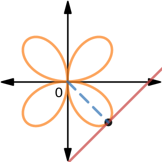

### Math265B Quiz 4
1\. Determine the exact area in the right portion of the curve $r=3+3\cos \th$ by setting up and evaluating the appropriate integral(s). That is, if it represented the coverage of a microphone, find the area convered on the stage.

>Solution
$$
\begin{aligned}
Area &= 2\int_0^{\frac{\pi}{2}} \frac{1}{2}(3 + 3\cos\th)^2 d\th\\
&= \int_0^{\frac{\pi}{2}} 9(\cos^2 \th + 2\cos\th + 1) d\th\\
&= \int_0^{\frac{\pi}{2}} 9(\frac{1}{2} + \frac{\cos {2\th}}{2} + 2\cos\th + 1) d\th\\
&= 9(\frac{3\th}{2} +\frac{1}{4} \sin {2\th} + 2\sin\th)\mid_0^{\frac{\pi}{2}}\\
&= \frac{27\pi}{4} + 18
\end{aligned}
$$

2\. Calculuatete the slope of the linear tangent to $r=2\sin 2\th$ at $(-2, \frac{3}{4}\pi)$. Sketch the relevant tangent line on the graph below.

>Solution
$$
\begin{aligned}
\frac{dy}{dx} &= \frac{f'(\th)\sin \th + f(\th) \cos \th}{f'(\th)\cos \th - f(\th) \sin \th}\\
&= \frac{4\cos 2\th \cos\th + 2\sin 2\th\sin\th}{4\cos 2\th \cos\th - 2\sin 2\th\sin\th}\\
\frac{dy}{dx} \mid_{\th=\frac{3\pi}{4}} &= \frac{4\cos {\frac{3\pi}{2}} \cos{\frac{3\pi}{4}}+ 2\sin {\frac{3\pi}{2}}\sin\th}{4\cos {\frac{3\pi}{2}} \cos{\frac{3\pi}{4}}- 2\sin {\frac{3\pi}{2}}\sin\th} =1
\end{aligned}
$$
