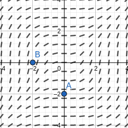
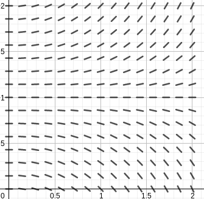
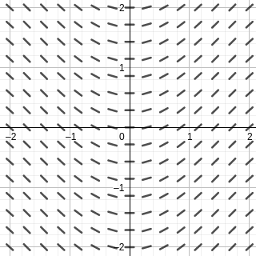
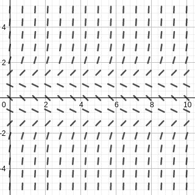
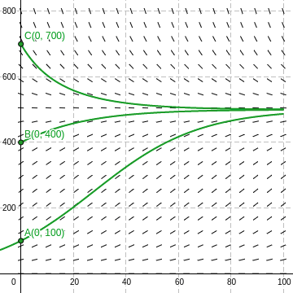
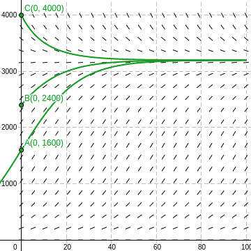
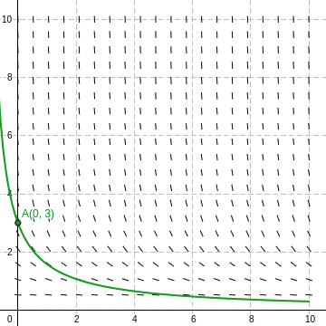

### Section 8.2 Direction Field and Eulers Method
p585: **Part 1**: In general, when it asks for direction field/slope field, you can use technology and you do not need to copy entire slope fields on paper. However, do include any specific solution curves requested. 2, 5, 7 (give a justification for each choice on #7), 11, 13, 15 (on #13 and 15 do three mini “slopes” by hand -- then use technology to finish. On paper show the three mini tangents and the requested solution curve), 17, 21, 23, 41, 42, 46, 48. **Part 2**: 3, 4, By hand: 25, 27, 28 Technology: 31, 33

2\. Consider the differential equation $y'(t) = t^2 - 3y^2$ and the solution curve that passes through the point $(3, 1)$. What is the slope of the curve at $(3, 1)$?
>Solution
The slope is $y'(3) = 3^2 - 3\cdot 1^2 = 6$.

3\. Consider the differential equation $y'(t) = t^2 - 3y^2, y(3) = 1$. What is the approximation to $y(3.1)$ given by Eulers method with a time step of $\Delta t=0.1$.
>Solution
$$
\begin{aligned}
y(3.1) &\approx y(3) + y'(3) \cdot \Delta t \\
&= 1 + (3^2-3) \cdot 0.1 = 1.6
\end{aligned}
$$

4\. Give a geometrical explanation of how Euler's method works.
>Solution
By dividing the interval $[0, T]$ into $N$ time steps of eqaul length $\Delta t = \dfrac{T}{N}$, we create a set of grid points, $t_0=0, t_1 = \Delta t, t_2 = 2\Delta t \cdots t_N = T$, the approximation $u_k$ to the exact solution at the grid points can be give as $u_{k+1} = u_k + f(t_k, u_k) \cdot \Delta t$. Each $u_k$ is an approximation to the exact solutions $y(t_k)$.

5–6\. **Direction fields** A differential equation and its direction field are shown in the following figures. Sketch a graph of the solution curve that passes through the given initial conditions.
5\. $y'(t) = \dfrac{t^2}{y^2 + 1}, y(0) = -2, y(-2) = 0$.
>Solution

7\. **Matching direction fields** Match equations a–d with direction fields A–D.
a. $y'(t) = \dfrac{t}{2}$ &emsp; b. $y'(t) = \dfrac{y}{2}$ &emsp; c. $y'(t) = \dfrac{t^2 + y^2}{2}$ &emsp; d. $y'(t) = \dfrac{y}{t}$
>Graph (7)
>Solution
a -> D. $t \in (0, \infty)$, the solutions are increasing; $t \in (-\infty, 0)$, the solutions are decreasing.
b -> B. $y \in (0, \infty)$, the solutions are increasing; $y \in (-\infty, 0)$, the solutions are decreasing.
c -> A. The solutions are always increasing.
d -> C. When $y=0$, there is a equilibrium solution.

9–11\. **Direction fields with technology** Plot a direction field for the following differential equation with a graphing utility. Then find the solutions that are constant and determine which initial conditions $y(0) = A$ lead to solutions that are increasing in time.
11\. $y'(t) =t(y-1), 0 \les t \les 2, 0 \les y \les 2$
>Solution

12–16\. **Sketching direction fields** Use the window $[-2, 2] \times [-2, 2]$ to sketch a direction field for the following equations. Then sketch the solution curve that corresponds to the given initial condition. A detailed direction field is not needed.
13\. $y'(t) = 4-y, y(0) = -1$
>Solution

15\. $y'(x) = \sin x, y(-2) =2$
>Solution

17–20\. **Increasing and decreasing solutions** Consider the following differential equations. A detailed direction field is not needed.
a. Find the solutions that are constant, for all $t\ges 0$ (the equilibrium solutions).
b. In what regions are solutions increasing? Decreasing?
c. Which initial conditions $y(0) = A$ lead to solutions that are increasing in time? Decreasing?
d. Sketch the direction field and verify that it is consistent with parts a–c.
17\. $y'(t) = (y - 1)(1 + y)$
>Solution
a. The constant functions $y(t)=1$ and $y(t)=-1$ are the equilibrium solutions.
b. The solutions are increasing when $y\in(-\infty, -1) \bigcup (1, \infty)$, and are decreasing when $y\in(-1, 1)$.
c. Graph (17).

21–24\. **Logistic equations** Consider the following logistic equations, for $t\ges 0$. In each case, sketch the direction field, draw the solution curve for each initial condition, and find the equilibrium solutions. A detailed direction field is not needed. Assume $t\ges 0$ and $P\ges 0$.
21\. $P'(t) = 0.05P(1-\dfrac{P}{500}); P(0)=100, 400, 700$
>Solution
Graph (21). The equilibrium solutions are $P(t) = 0$ and $P(t) = 500$.

23\. $P'(t) = 0.02P(4-\dfrac{P}{800}); P(0)=1600, 2400, 4000$
>Solution
Graph (23). The equilibrium solutions are $P(t) = 0$ and $P(t) = 3200$.

25–28\. **Two steps of Euler's method** For the following initial value problems, compute the first two approximations $u_1$ and $u_2$ given by Euler's method using the given time step.
25\. $y'(t)=2y, y(0) = 2; \Delta t = 0.5$
>Solution
$$
\begin{aligned}
u_0 &= y(0) = 2\\
f(t_0, u_0) &= f(0, 2) = 2 \cdot 2 = 4\\
u_1 &= u_0 + f(t_0, u_0)\cdot 0.5 = 2 + 4\cdot 0.5 = 4\\
f(t_1, u_1) &= f(0.5, 4) = 2 \cdot 4 = 8\\
u_2 &= u_1 + f(t_1, u_1)\cdot 0.5 = 4 + 8\cdot 0.5 = 8
\end{aligned}
$$
So $y(0.5) \approx u_1 = 4$ and $y(1) \approx u_2 = 8$.

27\. $y'(t)=2-y, y(0) = 1; \Delta t = 0.1$
>Solution
$$
\begin{aligned}
u_0 &= y(0) = 1\\
f(t_0, u_0) &= f(0, 1) = 2-1 = 1\\
u_1 &= u_0 + f(t_0, u_0)\cdot 0.1 = 1 + 1\cdot 0.1 = 1.1\\
f(t_1, u_1) &= f(0.1, 1.1) = 2 -1.1 = 0.9\\
u_2 &= u_1 + f(t_1, u_1)\cdot 0.1 = 1.1 + 0.9\cdot 0.1 = 1.19
\end{aligned}
$$
So $y(0.1) \approx u_1 = 1.1$ and $y(0.2) \approx u_2 = 1.19$.

28\. $y'(t)=t+y, y(0) = 4; \Delta t = 0.5$
>Solution
$$
\begin{aligned}
u_0 &= y(0) = 4\\
f(t_0, u_0) &= f(0, 4) = 0+4 = 4\\
u_1 &= u_0 + f(t_0, u_0)\cdot 0.1 = 4 + 4\cdot 0.5 = 6\\
f(t_1, u_1) &= f(0.5, 6) = 0.5+6 = 6.5\\
u_2 &= u_1 + f(t_1, u_1)\cdot 0.1 = 6 + 6.5\cdot 0.5 = 9.25
\end{aligned}
$$
So $y(0.5) \approx u_1 = 6$ and $y(1) \approx u_2 = 9.25$.

29–32\. **Errors in Euler's method** Consider the following initial value problems.
a. Find the approximations to $y(0.2)$ and $y(0.4)$ using Euler's method with time steps of $\Delta t = 0.2, 0.1, 0.05$, and $0.025$.
b. Using the exact solution given, compute the errors in the Euler approximations at $t = 0.2$ and $t = 0.4$.
c. Which time step results in the more accurate approximation? Explain your observations.
d. In general, how does halving the time step affect the error at $t = 0.2$ and $t = 0.4$
31\. $y'(t) = 4-y, y(0)=3; y(t) = 4-e^{-t}$
>Solution
$\Delta t$ | $y(0.2)$ | Error $y(0.2)$ |$y(0.4)$ | Error $y(0.4)$ |
-----------|----------|----------------|---------|----------------|
0.2   | 0.8     | 0.01837 | 0.64    | 0.03032 |
0.1   | 0.81    | 0.00873 | 0.65610 | 0.01422 |
0.05  | 0.81451 | 0.00422 | 0.66342 | 0.00690 |
0.025 | 0.81665 | 0.00208 | 0.66692 | 0.00340 |
c. When $\Delta t = 0.025$, the approximation is more accurate.
d. By halving the time step, the error is reduced by approximately 2 times.

38–43\. **Equilibrium solutions** A differential equation of the form $y'(t) = f(y)$ is said to be autonomous (the function $f$ depends only on $y$). The constant function $y = y_0$ is an equilibrium solution of the equation provided $f(y_0) = 0$ (because then $y'(t) = 0$ and the solution remains constant for all $t$). Note that equilibrium solutions correspond to horizontal lines in the direction field. Note also that for autonomous equations, the direction field is independent of $t$. Carry out the following analysis on the given equations.
a. Find the equilibrium solutions.
b. Sketch the direction field, for $t\ges 0$.
c. Sketch the solution curve that corresponds to the initial condition $y(0) = 1$.
41\. $y'(t) = y(y-3)$
>Solution
The function $y(t) = 0$ and $y(t)=3$ are equilibrium solutions. Graph (41).

42\. $y'(t) = \sin y$
>Solution
The function $y(t) = k\pi$ are equilibrium solutions, where $k$ is an integer. Graph (42).

46\. **Drug infusion** The delivery of a drug (such as an antibiotic) through an intravenous line may be modeled by the differential equation $m'(t) + km(t) = I$, where $m(t)$ is the mass of the drug in the blood at time $t\ges 0$, $k$ is a constant that describes the rate at which the drug is absorbed, and $I$ is the infusion rate. Let $I = 10 mg/hr$ and $k = 0.05 hr^{-1}$.
a. Draw the direction field, for $0 \les t \les 100, 0 \les y \les 600$.
b. What is the equilibrium solution?
c. For what initial values $m(0) = A$ are solutions increasing? Decreasing?
>Solution
$m'(t) = 10 - 0.05m(t)$. The function $m(t) = 200$ is the equilibrium solution. When $m\in [0, 200)$, the solutions are increasing; when $m\in (200, 600]$, the solutions are decreasing.
Graph (46).

48\. **Chemical rate equations** Consider the chemical rate equations $y'(t) = -ky(t)$ and $y'(t) = -ky^2 (t)$, where $y(t)$ is the concentration of the compound for $t\ges 0, k>0$ is a constant that determines the speed of the reaction. Assume that the initial concentration of the compound is $y(0) = y_0 > 0$.
a. Let $k = 0.3$ and make a sketch of the direction fields for both equations. What is the equilibrium solution in both cases?
b. According to the direction fields, which reaction approaches its equilibrium solution faster?
>Solution
a. For $y'(t) = -0.3y(t)$, the function $y(t) = 0$ is the equilibrium solutoon.
For $y'(t) = -0.3y^2(t)$, the function $y(t) = 0$ is the equilibrium solutoon.
b. Accoring to graph, the second approach reaches its equilibrium fasters.
First approach. $y'(t) = -0.3y(t), y_0 = 3$

Second approach. $y'(t) = -0.3y^2(t), y_0 = 3$

